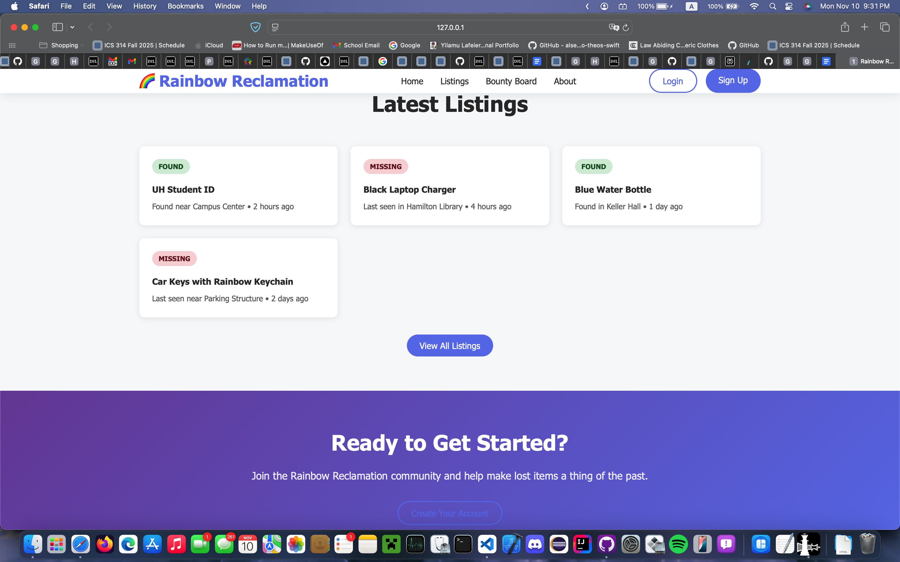

# The Mānoa Warrior Collective

## Contents

- [The Rundown](#the-rundown)
  - [Goals](#goals)
- [Projected Features](#projected-features)
- [Mockup Examples](#mockup-examples)
- [Team Agreement](#team-agreement)

## The Rundown

The Mānoa Warrior Collective presents Rainbow Reclamation: a projected web application designed to be a virtual lost and found for Mānoa students.

### Goals

Nothing is lost forever. We're here to prove that. Rainbow Reclamation is projected to be an all in one virtual lost and found client. Students, faculty, and staff all have much more important things to worry about (like what flavor of cup noodles will be for dinner) than lost property.

To save you an extra trip to the DMV for that dang ID you lost, the next section will detail how we intend on safekeeping lost items.

## Projected Features

Rainbow Reclamation will be designed to initially only have offical postings from the Manoa lost and found for security reasons. As the project grows, a verification system for user submitted lost goods will be explored.

User features:

- Landing page (Shows most recent listings)
- Profile page (User)
  - Should contain basic student info (Name and department)
- Create Missing Poster
  - Users can create requests to locate lost items
  - Option to offer reqard (future/beyond the basics)
- "Bounty" board
  - Requests for locates will appear here

Admin features:

- Landing Page (Admin control panel)
- Profile Page (Admin)
  - Stands apart from a user profile
  - Should contain Organization/staff name and affilation
- Create Posting
  - Will allow admins to list identifiers, last location seen, and a discussion pool for tips(?)
  - Interactive map with reported locations (future/beyond the basics)
- and more

## Mockup Examples

As an example, the landing page to an unregistered account can potentially look as such.

## Team Members

    

        
        
Rhys Dhustin Ocana

    

    

        
        
Allen Long

    

Dylan Dela Cruz

Yilamu Lafeier

## Team Agreement

As a guarantee that each team member is on track and is invested in this project, a team contract has been drafted. You can find the document [here](https://docs.google.com/document/d/1_5ayYJOEpRPB7yc-o9er692Hf58jUFygjcanW6NamCM/edit?usp=sharing).
