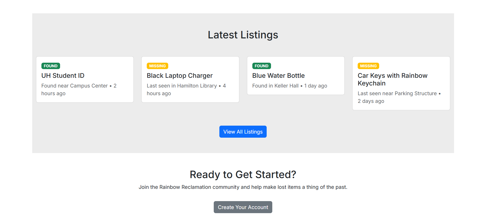
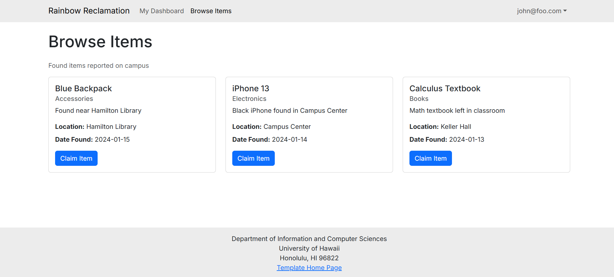
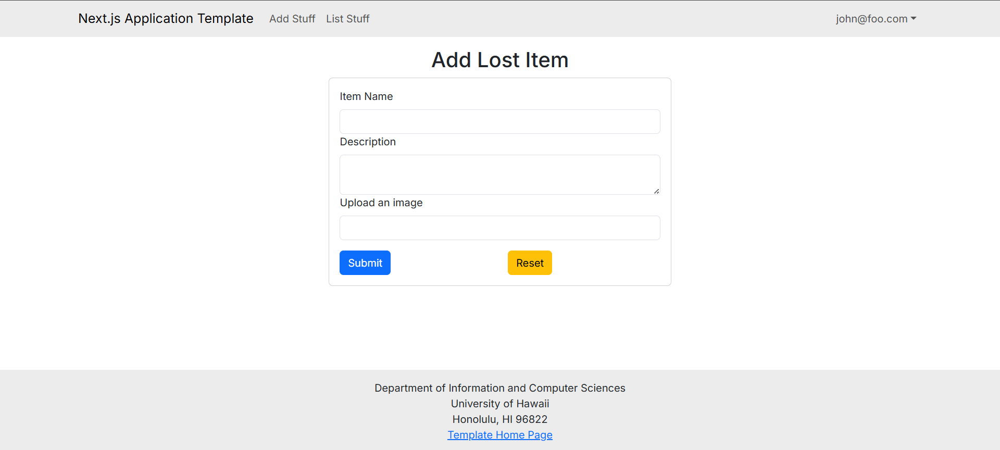
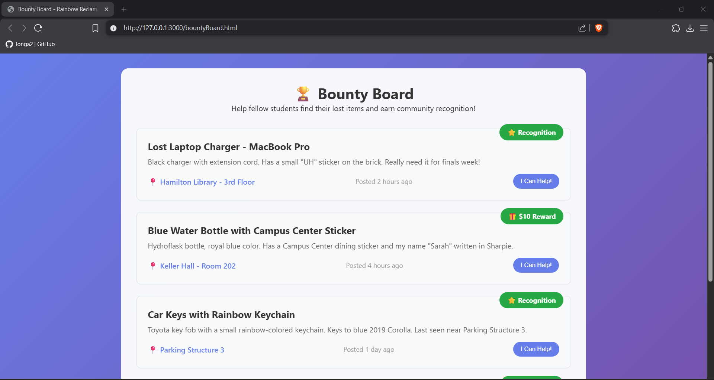
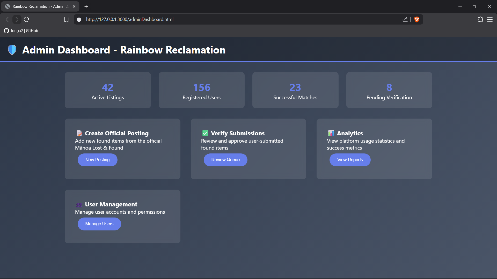

# Rainbow Reclamation

## Contents

- [Project Deployement](#project-deployment)
- [Current Progress](#current-progress)
- [The Rundown](#the-rundown)
  - [Goals](#goals)
- [Projected Features](#projected-features)
- [Risk & Management](#risk-&-mangement)
- [Team Members](#team-members)
- [Team Agreement](#team-agreement)

## Project Deployement

Rainbow Reclamation can be found [here](https://rainbow-reclamation.vercel.app/).

Please expect changes as it is currently in development.

## Current Progress

Our current progression in building this application for M2 can be found [here](https://github.com/orgs/manoa-warrior-collective/projects/5).

Our projected issues for the next stage of development for M3 can be found [here](https://github.com/orgs/manoa-warrior-collective/projects/6).

User Features:

- Landing page (User)
  - Basic introduction to the site
  - Overview of the website functionalities
  - Should contain a Sign Up feature at the bottom of the page

- Dashboard page
  - Users can see the status of their current lost items
  - Users can see items they found themseleves
  - Creates a button link to your lost item lists

- Browse Item
  - Shows a page of the user's lost items and check has a claim button to verify item has been retrieved

- Report Page
- User are able to upload the item name, the description, and a picture

Admin features:

- Admin Dashboard
  - Contain a list of users
  - Verfiy and approve lost item reports
  - Create new lost item posts
  - Analytic data to show usage of website and success rate of finding reported lost items
  - Manage user account standing
  - Track current users, find items, post verification, lost items

## The Rundown

The Mānoa Warrior Collective presents Rainbow Reclamation: a projected web application designed to be a virtual lost and found for Mānoa students.

### Goals

Nothing is lost forever. We're here to prove that. Rainbow Reclamation is projected to be an all in one virtual lost and found client. Students, faculty, and staff all have much more important things to worry about (like what flavor of cup noodles will be for dinner) than lost property.

To save you an extra trip to the DMV for that dang ID you lost, the next section will detail how we intend on safekeeping lost items.

## Projected Features

Rainbow Reclamation will be designed to initially only have offical postings from the Manoa lost and found for security reasons. As the project grows, a verification system for user submitted lost goods will be explored.

User features:

- Landing page (Shows most recent listings)

- Profile page (User)
  - Should contain basic student info (Name and department)
- Create Missing Poster
  - Users can create requests to locate lost items
  - Option to offer reqard (future/beyond the basics)
- "Bounty" board
  - Requests for locates will appear here

Admin features:

- Landing Page (Admin control panel)
- Profile Page (Admin)
  - Stands apart from a user profile
  - Should contain Organization/staff name and affilation
- Create Posting
  - Will allow admins to list identifiers, last location seen, and a discussion pool for tips(?)
  - Interactive map with reported locations (future/beyond the basics)
- and more

## Risk & Management

<table border="1" cellspacing="0" cellpadding="10">
  <tr>
    <th align="left" width="30%">Risk</th>
    <th align="left" width="70%">Mitigation Strategy</th>
  </tr>
  <tr>
    <td>1. Resource Constraints</td>
    <td>Find consistent time to work</td>
  </tr>
  <tr>
    <td>2. Poor Project Planning</td>
    <td>Set Project Milestone dates</td>
  </tr>
  <tr>
    <td>3. Poor Communication</td>
    <td>Hold other team members accountable for meetings</td>
  </tr>
  <tr>
    <td>4. Scope Creep</td>
    <td>Focus on your set issues in the Milestone</td>
  </tr>
  <tr>
    <td>5. Unclear Requirements</td>
    <td>Sit down with group members to have a detail discussion</td>
  </tr>
  <tr>
    <td>6. Technical Complexity</td>
    <td>Break down issues into simpler tasks through discussion</td>
  </tr>
  <tr>
    <td>7. Inadequate Team Skills</td>
    <td>Discussion, Coding Aid, AI</td>
  </tr>
</table>

## Team Members

<table border="0" cellspacing="0" cellpadding="0" style="border: none;">
  <tr style="border: none;">
    <td align="center" width="25%" style="border: none;">
      
       
      Rhys Dhustin Ocana
    </td>
    <td align="center" width="25%" style="border: none;">
      
       
      Allen Long
    </td>
    <td align="center" width="25%" style="border: none;">
      
       
      Dylan Dela Cruz
    </td>
    <td align="center" width="25%" style="border: none;">
      
       
      Yilamu Lafeier
    </td>
  </tr>
</table>

## Coordination Strategy

Our team plans to meet at least 3 times a week either in-person or through discord for 1-2 hours.

## Team Agreement

As a guarantee that each team member is on track and is invested in this project, a team contract has been drafted. You can find the document [here](https://docs.google.com/document/d/1_5ayYJOEpRPB7yc-o9er692Hf58jUFygjcanW6NamCM/edit?usp=sharing).

## GitHub

Our GitHub organization [page](https://github.com/manoa-warrior-collective/).
